# MapArchive

## 项目介绍

本系统全称地图档案数字化管理系统平台（地图平台），用于对地图数字化成果进行统一存储管理和空间可视化分析。

## 前端项目

该仓库为项目的后端地址

前端地址：https://gitee.com/handsomeyangbo/mapsystemfront

## 系统功能

地图平台主要分为用户管理、地图管理、地图档案、地图分析四大模块。

系统提供地图档案信息和地图分析功能，用户需要注册登录以获取操作地图管理模块的权限，超级管理员统一管理用户权限。

地图平台地图管理模块为用户提供轻量级（单文件、压缩包）以及多层级（批量挂载）方式将地图数据按地图类别归类存储，并为用户提供数据下载接口。

用户可在地图档案模块查看对应地图类型的地图数据，也可详细查看单幅地图的元数据信息和多层级瓦片信息。

地图平台依据地图图幅信息，为每幅地图计算坐标范围，为用户提供地图空间化操作、查询。

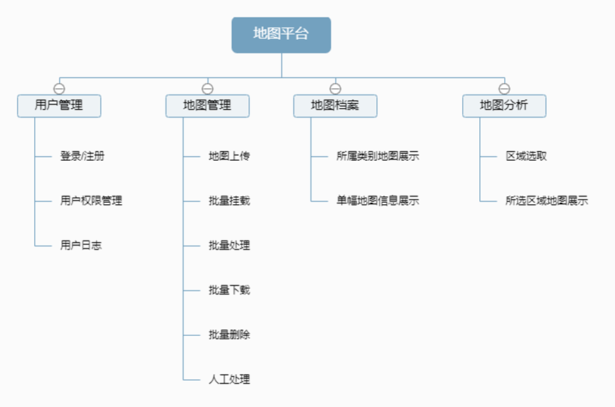

## 功能截图

### 用户管理

<table>
    <tr>
        <td>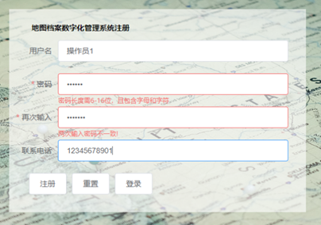</td>
        <td></td>
    </tr>
    <tr>
        <td>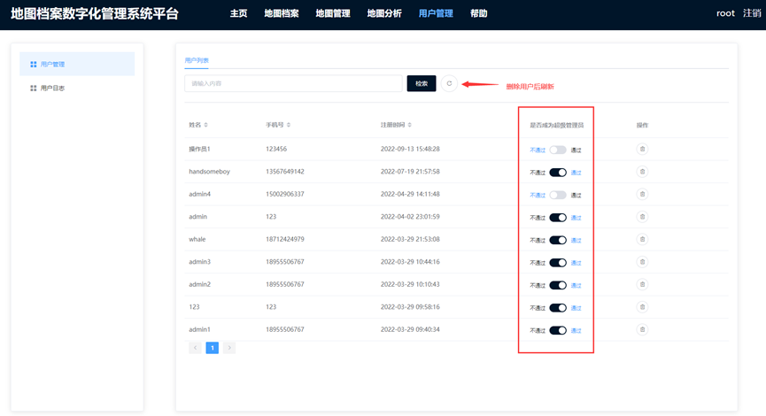</td>
        <td>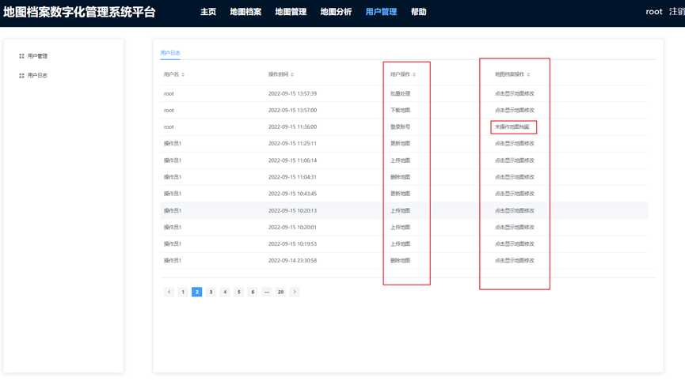</td>
    </tr>
</table>

### 地图管理

<table>
    <tr>
        <td>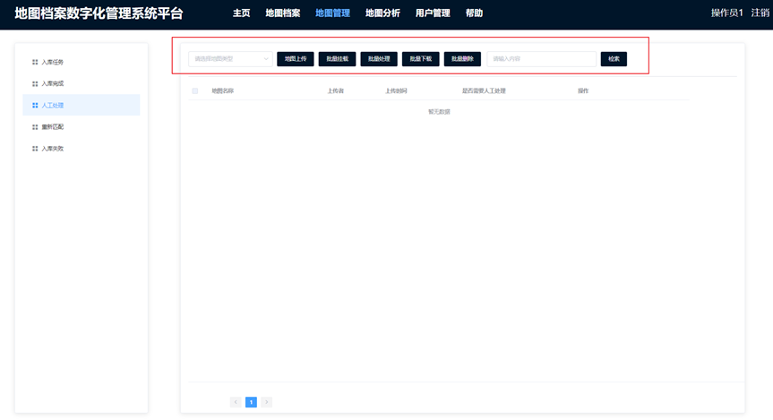</td>
        <td>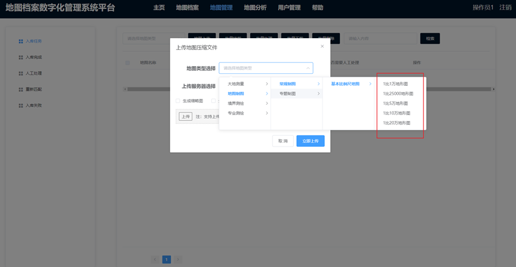</td>
    </tr>
    <tr>
        <td>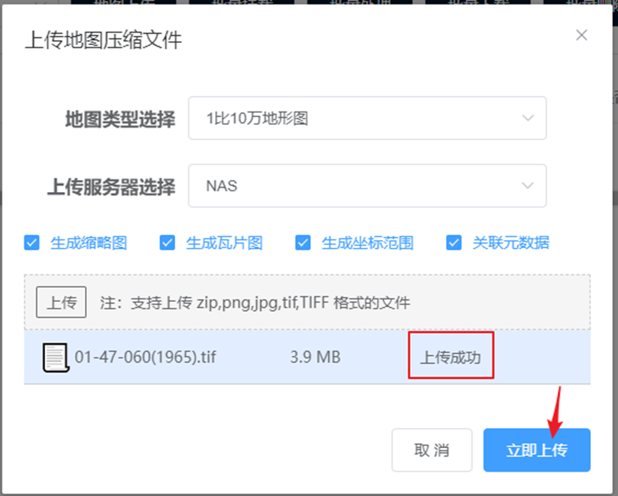</td>
        <td>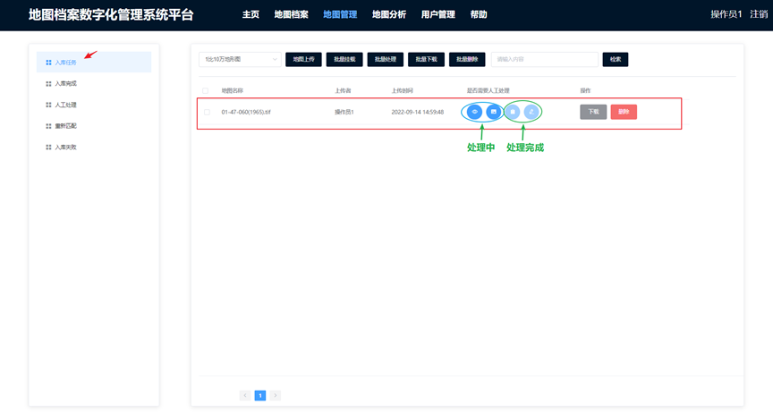</td>
    </tr>
    <tr>
        <td>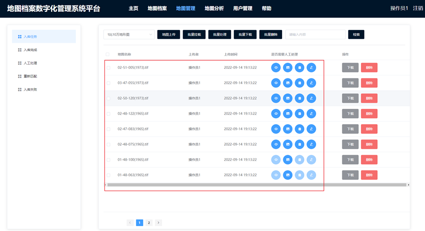</td>
        <td>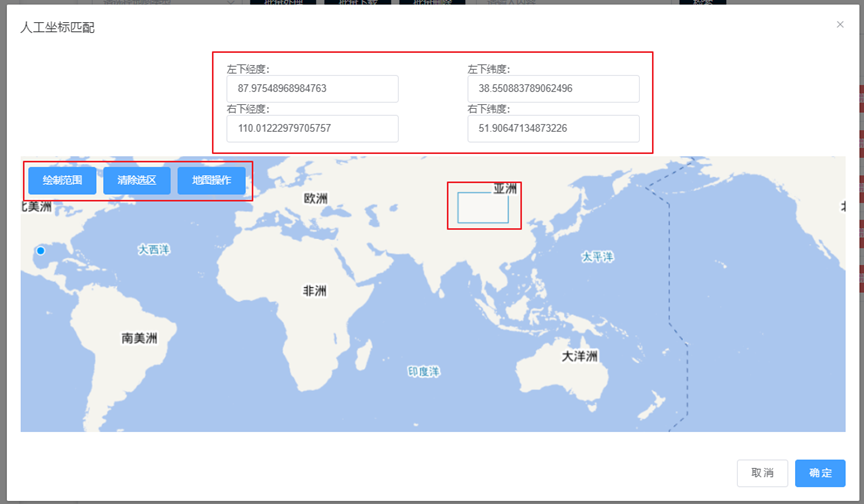</td> 
    </tr>
    <tr>
        <td>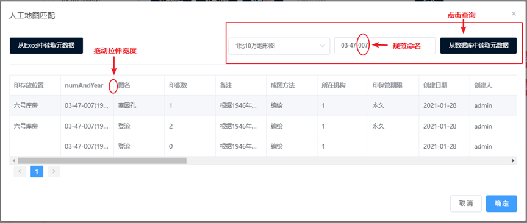</td>
    </tr>
</table>

### 地图档案

<table>
    <tr>
        <td>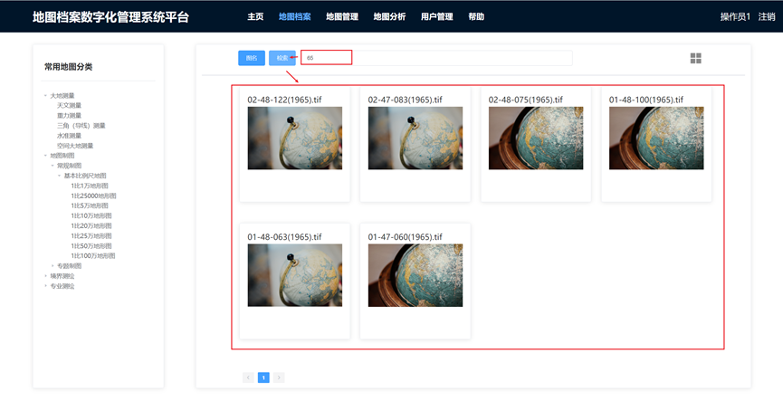</td>
        <td>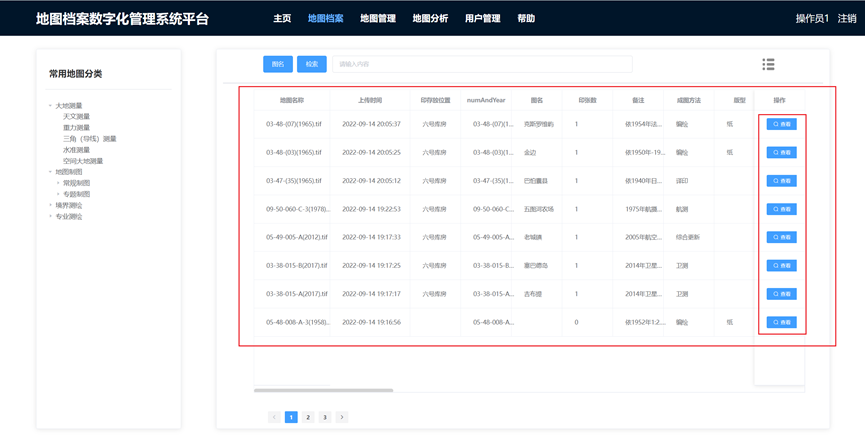</td>
    </tr>
    <tr>
        <td>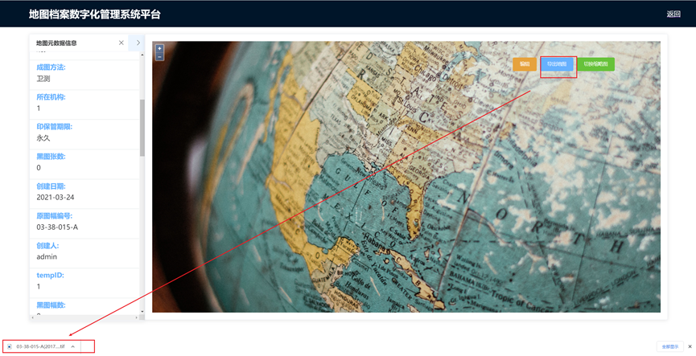</td> 
    	<td>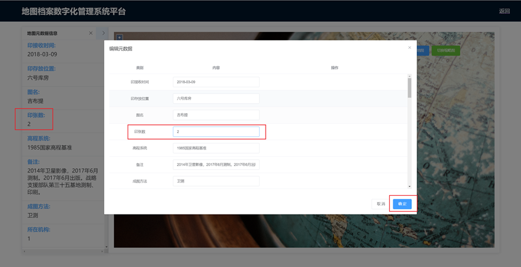</td>
    </tr>
</table>

### 地图分析

<table>
    <tr style="float:left">
        <td>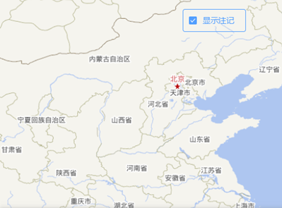</td>
        <td></td>
    </tr>
</table>

<table>
    <tr>
        <td>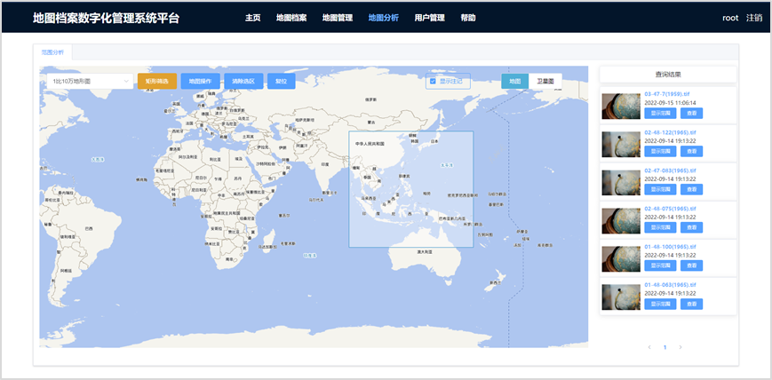</td> 
    	<td>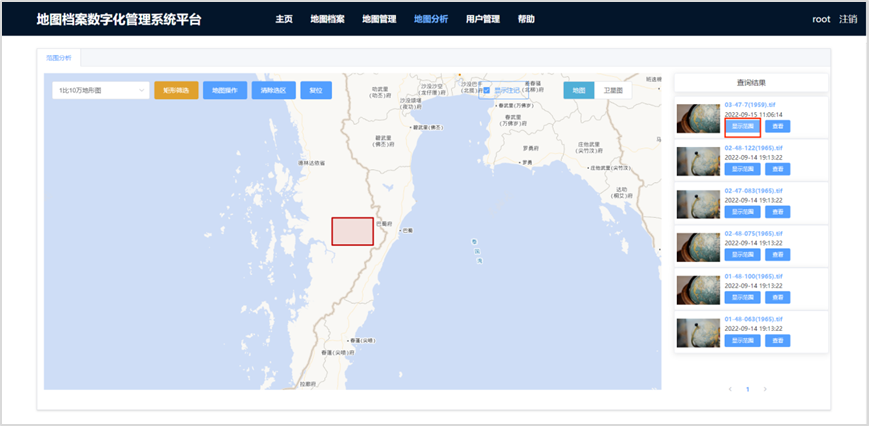</td>
    </tr>
</table>
